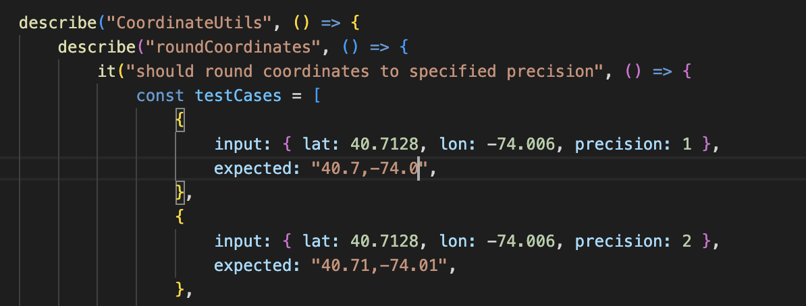

# Coding Challenge
This coding challenge will assess your ability to write software, work with an API, and store it in a data store that you may not have used before. You may choose any language to complete
this challenge that will best represent your ability; however, we prefer Golang, JavaScript, or
TypeScript.

Suggested time: 90 min.

## Weather API

Write software that fetches weather data from the National Weather Service API and stores the data in a Redis Cache. After storing the data, get the data from the redis cache and display some fields.

Hint: All languages have libraries to interact with Redis

You may run Redis locally in a containerized environment. To do so, install and run Docker. You may then create a simple Redis based Docker container with the command

```bash
docker run --name redis-container -p 6379:6379 -d redis
```

We will evaluate how you approach the problem, how you structure your code, and how you provide reliability through testing. In the name of scoping the problem, feel free to describe some of the things you would do, without completely fleshing them out. For example, if you normally add test cases to your code, you could add an example test and then describe some of the test cases that you would normally add.

## References

Examples of the National Weather Service API:
https://www.weather.gov/documentation/services-web-api

Docker:
https://www.docker.com/products/docker-desktop/#

How to Use the Redis Docker Official Image:
https://www.docker.com/blog/how-to-use-the-redis-docker-official-image/

Redis Clients:
https://redis.io/docs/latest/develop/clients/


## Working

## 1. Analysis and Reading

Created a simple diagram to understand the flow of the application.


Possible Questions:
* Do we need to add some kind of authentication to the API?
* Do we need to restrict the number of requests to the API?
* The data need to be handled in a specific format? (JSON, XML, etc)
* The data must be in a specific way in the Redis Cache?

Estimated used time: 20 minutes, I've read additional info about redis, possible changes on the Typescript/Express API, and about the National Weather Service API usage.

------

## 2. Setting up the project

Created an Express API with Typescript and a simple Redis connection. The Redis server was running on a Docker container, using the official image.


The node project was structured as follows:

``` 
weather/
  src/
    config/
      redis.ts
    controllers/
      weather.ts
    services/
      weather.ts
    index.ts
```

Possible changes/improvements: 
* Maybe add utils folder to add some helper functions.
* Maybe add providers folder to change to other weather API.
* Maybe add a folder to store the types (cause the time is short, I've not created it).

Estimated used time: 15 minutes, I've Docker so it was pretty fast to set up the project. 

------


## 3. Fetching weather

First, I tried to only fetch the data from the National Weather Service API. I've created a simple service to fetch the data and a controller to handle the request. When worked, I've added the Redis connection to store the data.


Estimated used time: 20 minutes, Take some time to understand how redis works and how to store the data.

------

## 4. Working with Grids

I noticed that store every coordinate in the Redis Cache could be an escalation problem. So I've decided to store the data in a grid system. I've created a simple grid to store the data and a function to get the data from the grid.


The idea is to store the data in a grid, we can go deep on this, but I've decided to just round the coordinates using a "precision" variable.


So this is the process:

1. We receive the coordinates from the request.
2. We round the coordinates using the precision variable.
3. We check if the grid exists in the Redis Cache.
4. If the grid exists, we return the data.
5. If the grid doesn't exist, we fetch the data from the National Weather Service API (using the non-rounded coordinates), create the new grid storing the data on the Redis Cache.
6. Finally, we return the data.

------

Possible changes/improvements:

* Layers with different precision values, and diferent redis expiration times.
* Add headers/params to the request to change the precision value.

------

Estimated used time: 25 minutes, I'explore the option of adding some layers to the grids.


## 5. Docker

I've created a Dockerfile to run the project.


Worked :)


The last part of the JSON have an additional value if the data was served from the Redis Cache.


## 5. Testing

When creating the test for the roundCoordinates function, I've noticed that the function was not working as expected. This is caused by the way that Javascript handles zeros next to the decimal point. I've fixed the function and created the tests.



I fixed the parameters of the tests. The function was working as expected. This function is private, but other code parts needs more tests. I tried to cover the most important parts on the code.


Finally worked, this take some time cause I've not remembered how to test with Jest. Estimated used time: 30 minutes.

# Final Considerations

Was a nice challenge, I've learned a lot about Redis, this are my first steps with this technology. I've not added some features that I've thought about, like the layers, but I think that the code is covering an initial version of the requirements, would be great to add some more tests and some more features to the code based on business requirements, like the user target, authentication, etc.